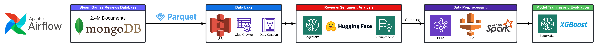

# Steam Game Purchase Prediction Pipeline

This project aims to predict whether a user is likely to purchase a Steam game based on **other users' review patterns and sentiments**. The pipeline leverages AWS infrastructure, Apache Airflow for orchestration, and a combination of tools including Apache Spark, SageMaker, and XGBoost to analyze reviews and predict purchase behavior.

## Project Overview

The goal of the project is to build a machine learning pipeline that predicts whether a user will purchase a **Steam game** based on the behavior and sentiment of previous reviewers. By analyzing review patterns, sentiment scores, and review behavior, the model aims to forecast a game’s attractiveness and likelihood of being purchased by other users.



### Workflow:

1. **Data Ingestion (MongoDB -> Parquet)**:
   - Steam game reviews are fetched from a MongoDB database.
   - The data is processed into Parquet format using Apache Airflow and stored in AWS S3 as the data lake.

2. **Sentiment Analysis**:
   - A Hugging Face model deployed on AWS SageMaker performs sentiment analysis on the review texts.
   - AWS Comprehend is also integrated to extract insights, such as positive and negative sentiment scores.

3. **Data Preprocessing**:
   - Reviews are sampled using AWS EMR (Elastic MapReduce) and Apache Spark.
   - The preprocessed data includes scaling and encoding features to prepare for model training. Features like review patterns, sentiment scores, and review counts are extracted.

4. **Purchase Prediction Model (Training & Evaluation)**:
   - XGBoost, a scalable and high-performance machine learning library, is used to train a predictive model on the pre-processed data. The model is designed to predict whether a **new user** will purchase a game based on the review patterns and sentiments of existing users.
   - The model is evaluated using metrics such as AUC (Area Under the Curve).

## Key Components

### 1. **Data Preparation**
   - Script: [`prepare_data.py`](./prepare_data.py)
   - This script performs data cleaning and transformation using PySpark. It extracts relevant features from the game reviews and processes them to be ready for model training. It scales numeric columns and encodes categorical features.
   - The processed data is split into training and validation sets and stored back in S3.

### 2. **Sentiment Analysis**
   - Script: [`sentiment_analysis.py`](./sentiment_analysis.py)
   - A pre-trained Hugging Face model (`distilbert-base-uncased-finetuned-sst-2-english`) deployed on AWS SageMaker is used to analyze the sentiment of game reviews.
   - Sentiment scores are added to each review, which are later used in predicting future game purchases. The processed data is saved back to S3 in Parquet format.

### 3. **Purchase Prediction Model Training**
   - Script: [`train.py`](./train.py)
   - A gradient-boosted tree classifier (GBTClassifier) from XGBoost is trained using features extracted from the reviews and sentiment analysis results.
   - The model predicts whether a new user will make a purchase based on the behavior and sentiment of other users who have already reviewed the game.
   - The accuracy of the model is evaluated using metrics like AUC (Area Under the Curve).
   - The trained model is saved to S3 for future inference.

### 4. **EMR Cluster Management**
   - Script: [`emr_cluster_manager.py`](./emr_cluster_manager.py)
   - This script manages the lifecycle of an AWS EMR cluster, which is used for distributed computing with Spark. It handles the creation, management, and termination of EMR clusters.

### 5. **Workflow Orchestration**
   - Script: [`main.py`](./main.py)
   - The `main.py` script orchestrates the entire workflow, from data preparation to model training and evaluation. It integrates with the EMR cluster to perform data preparation and model training steps. The workflow is logged, and errors are handled throughout the process.

## Technology Stack

- **Orchestration**: Apache Airflow
- **Data Storage**: MongoDB, AWS S3
- **Data Processing**: Apache Spark, AWS EMR
- **Machine Learning**: Hugging Face, AWS SageMaker, XGBoost
- **Programming Languages**: Python (PySpark, boto3 for AWS SDK)
- **Logging**: Python Logging module

## Setup & Usage

### Requirements

- AWS Account with access to S3, SageMaker, and EMR.
- MongoDB instance with Steam reviews dataset.
- Python environment with the following packages:
  - PySpark
  - boto3
  - sagemaker
  - HuggingFace Transformers

### Steps

1. **MongoDB to Parquet**: Set up an Apache Airflow DAG to extract data from MongoDB and load it into S3 as Parquet.
2. **Run Sentiment Analysis**: Deploy the sentiment analysis model using SageMaker and process the reviews.
3. **Data Preprocessing**: Run the `prepare_data.py` script to prepare the data for training.
4. **Model Training**: Execute the `train.py` script to train the XGBoost model using Spark on AWS EMR.
5. **Orchestrate the Workflow**: Use `main.py` to orchestrate the entire process from data preparation to model training and evaluation.

### Sample Commands

To run the sentiment analysis:

```bash
python sentiment_analysis.py
